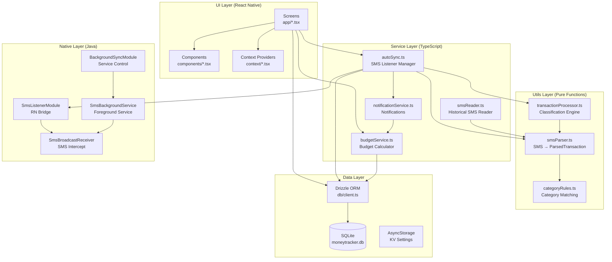
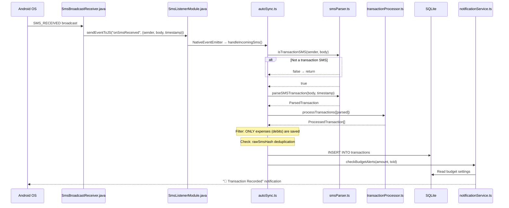
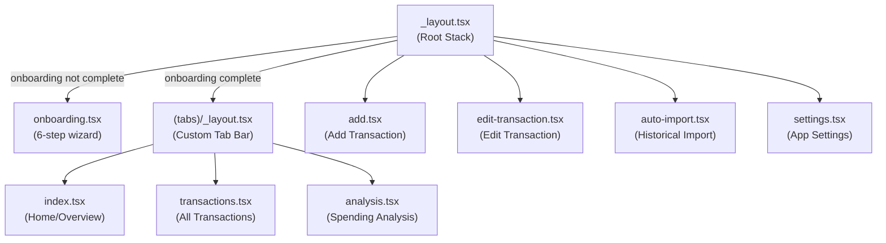

# Spense v1.0.0 — Design Document

> **A comprehensive technical reference for AI agents and developers to understand, navigate, and contribute to the Spense codebase.**

---

## Table of Contents

1. [Project Overview](#1-project-overview)
2. [Tech Stack & Dependencies](#2-tech-stack--dependencies)
3. [Project Structure](#3-project-structure)
4. [Architecture Overview](#4-architecture-overview)
5. [Database Layer](#5-database-layer)
6. [Data Flow & Pipelines](#6-data-flow--pipelines)
7. [Services Layer (Business Logic)](#7-services-layer-business-logic)
8. [Utils Layer (Pure Functions)](#8-utils-layer-pure-functions)
9. [Native Android Modules](#9-native-android-modules)
10. [Screens & Navigation](#10-screens--navigation)
11. [Components](#11-components)
12. [State Management & Context](#12-state-management--context)
13. [Notification System](#13-notification-system)
14. [Configuration & Build Tooling](#14-configuration--build-tooling)
15. [Development Workflow](#15-development-workflow)
16. [Key Design Decisions & Gotchas](#16-key-design-decisions--gotchas)
17. [Feature List (v1.0.0)](#17-feature-list-v100)

---

## 1. Project Overview

**Spense** is a privacy-first, on-device expense tracking app for Android that automatically reads bank SMS messages to track spending. It's built with React Native (Expo SDK 54) and uses custom native Java modules for real-time SMS interception.

### Core Philosophy

- **100% on-device** — no cloud, no accounts, no data leaves the phone
- **Automatic tracking** — real-time SMS parsing from Indian banks (HDFC, ICICI, SBI, Axis, UPI, etc.)
- **Smart intelligence** — classifies spending vs. transfers vs. refunds vs. ATM withdrawals vs. CC payments
- **Budget-aware** — configurable monthly budget with dynamic or fixed daily limits

### Key Identifiers

| Property | Value |
|---|---|
| **App Name** | Spense |
| **Package ID** | `com.spense.app` |
| **Bundle ID** | `com.spense.app` |
| **Database File** | `moneytracker.db` (SQLite) |
| **Expo SDK** | 54 |
| **React Native** | 0.81.5 |
| **Min Android SDK** | Default Expo (SDK 24+) |

---

## 2. Tech Stack & Dependencies

### Core Framework

| Layer | Technology | Version |
|---|---|---|
| **Framework** | React Native + Expo | SDK 54 / RN 0.81.5 |
| **Language** | TypeScript | 5.9.2 |
| **Styling** | NativeWind (TailwindCSS for RN) | 4.2.1 + Tailwind 3.4.19 |
| **Navigation** | Expo Router (file-based) | v6 |
| **Database** | Expo SQLite + Drizzle ORM | SQLite 16.0.10 / Drizzle 0.45.1 |
| **State** | React Context API | — |
| **Animations** | React Native Reanimated | 4.1.1 |

### Key Dependencies

```json
{
  "@react-native-async-storage/async-storage": "^2.2.0",  // KV storage for settings
  "expo-linear-gradient": "~15.0.8",                       // Gradient UI elements
  "expo-notifications": "~0.32.16",                         // Push notifications
  "expo-sqlite": "~16.0.10",                                // Local SQLite database
  "drizzle-orm": "^0.45.1",                                 // Type-safe ORM
  "react-native-get-sms-android": "^2.1.0",                // SMS reading (historical)
  "react-native-safe-area-context": "~5.6.0",              // Safe area handling
  "react-native-screens": "~4.16.0"                         // Native screen optimization
}
```

### Dev Dependencies

```json
{
  "babel-plugin-inline-import": "^3.0.0",   // Inline .sql migration files
  "drizzle-kit": "^0.31.8",                 // DB migration generation
  "typescript": "~5.9.2"
}
```

> [!IMPORTANT]
> This is **NOT an Expo Go project**. It requires a **development build** (`npx expo run:android`) because of custom native Java modules for SMS listening. Expo Go will not work.

---

## 3. Project Structure

```
spense/
├── app/                              # 📱 Expo Router screens (file-based routing)
│   ├── _layout.tsx                   # Root layout: DB init, migrations, notification handlers, onboarding gate
│   ├── (tabs)/                       # Tab navigator group
│   │   ├── _layout.tsx               # Custom floating tab bar with pill-highlight effect
│   │   ├── index.tsx                 # Home: "Safe to Spend" card + recent transactions
│   │   ├── transactions.tsx          # Full transaction list (tap=edit, long-press=actions)
│   │   └── analysis.tsx              # Spending analysis: charts, categories, merchants
│   ├── add.tsx                       # Manual transaction entry form
│   ├── edit-transaction.tsx          # Edit existing transaction (amount, category, description, type)
│   ├── auto-import.tsx               # Historical SMS import with date range + selection UI
│   ├── onboarding.tsx                # 6-step first-time setup wizard
│   └── settings.tsx                  # App configuration (budget, sync, theme, currency, reset)
│
├── components/                       # 🧩 Reusable UI components
│   ├── TransactionList.tsx           # SectionList with tap-to-edit + long-press actions
│   └── CategoryPicker.tsx            # Modal grid picker with "Add New Category" support
│
├── context/                          # 🌐 React Context providers
│   ├── ThemeContext.tsx              # Light/dark/auto theme management (NativeWind)
│   └── CurrencyContext.tsx           # Currency symbol selection (₹, $, €, £, ¥)
│
├── db/                               # 🗄️ Database layer
│   ├── client.ts                     # Drizzle ORM client instantiation
│   ├── schema.ts                     # Table definitions (transactions, categories, settings)
│   └── seed.ts                       # Default category seeding (10 categories with emoji icons)
│
├── services/                         # ⚙️ Business logic / service layer
│   ├── autoSync.ts                   # SMS auto-sync: listener init, real-time handling, missed SMS sync
│   ├── budgetService.ts              # Budget calculations: period, daily limit, remaining
│   ├── notificationService.ts        # Notification setup, budget alerts, action categories
│   └── smsReader.ts                  # Historical SMS reading via react-native-get-sms-android
│
├── utils/                            # 🔧 Pure utility functions
│   ├── smsParser.ts                  # SMS text → ParsedTransaction (regex-based)
│   ├── transactionProcessor.ts       # Classification engine, dedup, transfer/refund detection
│   └── categoryRules.ts             # Keyword → category mapping rules
│
├── android/                          # 🤖 Native Android code
│   └── app/src/main/java/com/spense/app/
│       ├── SmsListenerModule.java    # RN bridge: start/stop SMS listening
│       ├── SmsBroadcastReceiver.java # BroadcastReceiver: intercepts incoming SMS
│       ├── SmsBackgroundService.java # Foreground service: keeps listener alive when app closed
│       ├── BackgroundSyncModule.java # RN bridge: start/stop background service
│       ├── SmsListenerPackage.java   # ReactPackage registration
│       ├── MainActivity.java         # Standard Expo activity
│       └── MainApplication.java      # App class with package registration
│
├── drizzle/                          # 📋 Database migrations
│   ├── 0000_strange_puff_adder.sql   # Initial schema (categories, transactions)
│   └── meta/                         # Drizzle migration metadata
│
├── assets/                           # 🎨 Static assets
│   ├── icon.png                      # App icon
│   ├── adaptive-icon.png             # Android adaptive icon
│   ├── splash-icon.png               # Splash screen icon
│   └── favicon.png                   # Web favicon
│
├── types/                            # 📝 TypeScript type declarations
│   └── react-native-get-sms-android.d.ts
│
├── app.json                          # Expo config (permissions, plugins, icons)
├── package.json                      # Dependencies & scripts
├── babel.config.js                   # Babel: NativeWind, inline-import (.sql), Reanimated
├── metro.config.js                   # Metro bundler: NativeWind integration
├── tailwind.config.js                # TailwindCSS: content paths, dark mode, theme colors
├── drizzle.config.ts                 # Drizzle Kit: schema path, output, dialect
├── tsconfig.json                     # TypeScript configuration
└── global.css                        # Global CSS entry point for NativeWind
```

---

## 4. Architecture Overview



### Layered Architecture

The app follows a **clean layered architecture**:

1. **UI Layer** → Screens + Components + Context (React Native / Expo Router)
2. **Service Layer** → Business logic, orchestration (autoSync, budget, notifications)
3. **Utils Layer** → Pure functions, no side effects (parsing, classification, rules)
4. **Data Layer** → SQLite via Drizzle ORM + AsyncStorage for KV pairs
5. **Native Layer** → Custom Java modules for Android SMS capabilities

> [!NOTE]
> Data flows **downward** only. Utils never import from Services. Services never import from UI. The Data layer is accessed by both Services and UI (direct DB queries in some components).

---

## 5. Database Layer

### ORM: Drizzle + Expo SQLite

- **Client**: [db/client.ts](file:///home/avisubuntu/Documents/Projects/MoneyTracker/db/client.ts) — Instantiates Drizzle with `expo-sqlite`
- **Schema**: [db/schema.ts](file:///home/avisubuntu/Documents/Projects/MoneyTracker/db/schema.ts) — Table definitions
- **Seeds**: [db/seed.ts](file:///home/avisubuntu/Documents/Projects/MoneyTracker/db/seed.ts) — Default categories
- **Database file**: `moneytracker.db` (on-device SQLite)

### Tables

#### `transactions`

| Column | Type | Constraints | Description |
|---|---|---|---|
| `id` | INTEGER | PK, AUTOINCREMENT | Unique transaction ID |
| `amount` | REAL | NOT NULL | Transaction amount |
| `category` | TEXT | NOT NULL | Category name (FK-ish to categories.name) |
| `description` | TEXT | nullable | Merchant name or user description |
| `date` | INTEGER | NOT NULL | Unix timestamp in **milliseconds** |
| `type` | TEXT | NOT NULL | `'expense'` or `'income'` |
| `source` | TEXT | DEFAULT `'manual'` | `'manual'` or `'sms'` |
| `transaction_class` | TEXT | DEFAULT `'spending'` | `'spending'` \| `'income'` \| `'salary'` \| `'transfer'` \| `'refund'` \| `'atm'` \| `'cc_payment'` |
| `linked_transaction_id` | INTEGER | nullable | FK to paired transaction (for transfers/refunds) |
| `raw_sms_hash` | TEXT | nullable | Hash of raw SMS body for deduplication |
| `account` | TEXT | nullable | Last 4 digits of account/card number |
| `is_ignored` | INTEGER | DEFAULT 0 | Boolean: user excluded from budget calculations |

#### `categories`

| Column | Type | Constraints | Description |
|---|---|---|---|
| `id` | INTEGER | PK, AUTOINCREMENT | Unique category ID |
| `name` | TEXT | NOT NULL, UNIQUE | Category display name |
| `icon` | TEXT | nullable | Emoji icon (e.g., `🍔`, `🛒`) |

**Default Categories** (seeded on first launch):

| Name | Icon |
|---|---|
| Ordered Food | 🍔 |
| Groceries | 🛒 |
| Online Purchases | 🛍️ |
| Subscriptions | 📅 |
| Fuel/Travel | ⛽ |
| Bills | 💡 |
| Health | 🏥 |
| Salary | 💰 |
| Entertainment | 🎬 |
| Others | 📦 |

#### `settings`

| Column | Type | Constraints | Description |
|---|---|---|---|
| `id` | INTEGER | PK, AUTOINCREMENT | Row ID |
| `key` | TEXT | NOT NULL, UNIQUE | Setting key |
| `value` | TEXT | NOT NULL | Setting value (always stored as string) |

**Known Settings Keys** (stored in `settings` table):

| Key | Example Value | Description |
|---|---|---|
| `monthly_budget` | `"30000"` | Monthly spending limit |
| `start_day` | `"1"` | Budget reset day (1-28) |
| `budget_mode` | `"dynamic"` | `"dynamic"` or `"fixed"` |
| `currency` | `"₹"` | Currency symbol |
| `alert_daily_90_YYYY-MM-DD` | `"sent"` | Daily alert sent flag |
| `alert_monthly_90_YYYY-M` | `"sent"` | Monthly alert sent flag |

### AsyncStorage Keys

These are stored in React Native's AsyncStorage (not SQLite):

| Key | Description |
|---|---|
| `autoSyncEnabled` | Whether auto-sync is on (`"true"` / `"false"`) |
| `lastSyncTimestamp` | Unix ms of last successful sync |
| `installationTimestamp` | Unix ms of first app launch |
| `onboarding_completed` | Whether onboarding is done (`"true"`) |
| `user-theme` | `"light"` or `"dark"` |
| `auto-theme` | Whether to follow system theme (`"true"` / `"false"`) |

### Migrations

> [!WARNING]
> Migrations are **NOT** managed by Drizzle Kit at runtime. The app uses `expoDb.execSync()` in [app/_layout.tsx](file:///home/avisubuntu/Documents/Projects/MoneyTracker/app/_layout.tsx) to run `CREATE TABLE IF NOT EXISTS` and `ALTER TABLE ADD COLUMN` statements at startup. Failed ALTERs (column already exists) are silently caught. This is a pragmatic approach for a single-user mobile app.

The migration strategy is:
1. `CREATE TABLE IF NOT EXISTS` for all 3 tables
2. Sequential `ALTER TABLE ADD COLUMN` for each column added post-v1.0 (source, transaction_class, linked_transaction_id, raw_sms_hash, account, is_ignored)
3. Each ALTER is wrapped in try/catch — if it fails (column exists), it's silently ignored

---

## 6. Data Flow & Pipelines

### Pipeline 1: Real-Time SMS → Transaction

This is the core pipeline that runs when a new SMS arrives on the device:



### Pipeline 2: Historical SMS Import

Triggered from Settings → Auto Import screen or during onboarding:

```
User selects date range → smsReader.readSMSMessages({startDate, endDate})
    → SmsAndroid.list() (native read from inbox)
    → filter with isTransactionSMS() for each SMS
    → parseSMSTransaction() for matches
    → processTransactions() for classification
    → deduplicateByHash() against existing DB hashes
    → User reviews & selects transactions
    → Batch INSERT into SQLite
```

### Pipeline 3: Missed SMS Sync (Automatic)

Runs on every app launch if auto-sync is enabled:

```
App launches → initializeSmsListener()
    → syncMissedSMS()
    → Read lastSyncTimestamp from AsyncStorage
    → readSMSMessages({startDate: lastSyncTimestamp})
    → processTransactions() + deduplication
    → Filter to expenses only
    → Batch INSERT + notifications per transaction
    → Update lastSyncTimestamp
```

### Pipeline 4: Budget Calculation

Called by Home screen (every 5 seconds), notifications, and after any transaction change:

```
calculateDailyBudget()
    → getBudgetSettings() from settings table
    → getCurrentPeriod(startDay) → {start, end} dates
    → SELECT * FROM transactions (all)
    → Filter: period range + not ignored
    → Sum expenses (transactionClass='spending' or legacy type='expense')
    → Sum refunds (transactionClass='refund') → subtract from expenses
    → Calculate daysLeft
    → If DYNAMIC mode: dailyLimit = remaining / daysLeft
    → If FIXED mode:   dailyLimit = (monthlyLimit / totalDays) - spentToday
    → Return BudgetStatus object
```

---

## 7. Services Layer (Business Logic)

### [autoSync.ts](file:///home/avisubuntu/Documents/Projects/MoneyTracker/services/autoSync.ts) — SMS Auto-Sync Service

The central orchestrator for all SMS-related functionality.

**Key Exports:**

| Function | Description |
|---|---|
| `initializeSmsListener()` | Called on app launch. Sets install timestamp, starts listener if enabled, syncs missed SMS |
| `startListening()` | Requests SMS permissions, starts native `SmsListenerModule`, sets up `NativeEventEmitter`, starts background service |
| `stopListening()` | Removes event subscription, stops native listener and background service |
| `isAutoSyncEnabled()` | Reads from AsyncStorage |
| `setAutoSyncEnabled(enabled)` | Writes to AsyncStorage, starts/stops listener accordingly |
| `importHistoricalSms()` | Public wrapper for `syncMissedSMS()` |

**Internal Functions:**

| Function | Description |
|---|---|
| `handleIncomingSms(event)` | Processes a single incoming SMS event: parse → classify → dedup → insert → notify |
| `syncMissedSMS()` | Reads all SMS since `lastSyncTimestamp` (or `installationTimestamp`), bulk processes and imports |

> [!IMPORTANT]
> **Income filtering**: Both `handleIncomingSms` and `syncMissedSMS` explicitly filter out income transactions (`type === 'income'`). Only expenses/debits are auto-imported. This is a deliberate user-preference design choice.

---

### [budgetService.ts](file:///home/avisubuntu/Documents/Projects/MoneyTracker/services/budgetService.ts) — Budget Calculations

**Key Exports:**

| Function | Signature | Description |
|---|---|---|
| `getBudgetSettings()` | `→ Promise<BudgetSettings>` | Reads monthly_budget, start_day, budget_mode from settings table |
| `updateBudgetSettings(limit, startDay, mode)` | `→ Promise<void>` | Upserts all 3 settings |
| `getCurrentPeriod(startDay)` | `→ {start: Date, end: Date}` | Calculates the current budget cycle dates based on reset day |
| `calculateDailyBudget()` | `→ Promise<BudgetStatus>` | Full budget status calculation |

**Key Interfaces:**

```typescript
interface BudgetSettings {
    monthlyLimit: number;    // e.g., 30000
    startDay: number;        // 1-28 (day of month budget resets)
    budgetMode: 'dynamic' | 'fixed';
}

interface BudgetStatus {
    dailyLimit: number;      // "Safe to spend today" amount
    remainingTotal: number;  // Remaining for the month
    spentTotal: number;      // Total spent this period
    spentToday: number;      // Spent today
    monthlyLimit: number;    // Configured monthly budget
    daysLeft: number;        // Days remaining in period
    periodStart: Date;
    periodEnd: Date;
    isOverBudget: boolean;   // remainingTotal < 0
    budgetMode: 'dynamic' | 'fixed';
}
```

**Budget Modes:**

| Mode | Formula | Behavior |
|---|---|---|
| **Dynamic** | `dailyLimit = remainingTotal / daysLeft` | Recalculates daily based on remaining budget. Underspending one day gives more the next. |
| **Fixed** | `dailyLimit = (monthlyLimit / totalDaysInPeriod) - spentToday` | Strict daily allowance. Each day gets the same base amount. |

> [!NOTE]
> `getCurrentPeriod(startDay)` handles the wrap-around logic. If today is the 5th and `startDay=25`, the period is 25th of last month → 24th of this month.

---

### [notificationService.ts](file:///home/avisubuntu/Documents/Projects/MoneyTracker/services/notificationService.ts) — Notifications

**Key Exports:**

| Function | Description |
|---|---|
| `setupNotifications()` | Requests permission, registers `new_transaction` action category with 3 actions |
| `checkBudgetAlerts(amount?, txId?)` | Sends transaction notification + checks 90% daily/monthly thresholds |

**Notification Actions (registered as `new_transaction` category):**

| Action ID | Button | Behavior |
|---|---|---|
| `NAME_ACTION` | ✏️ Name | Inline text input → updates `description` column |
| `IGNORE_ACTION` | 🙈 Ignore | Sets `is_ignored = 1` → recalculates budget |
| `DELETE_ACTION` | 🗑️ Delete | Deletes transaction → recalculates budget |

> [!IMPORTANT]
> The notification **action handlers** are in [app/_layout.tsx](file:///home/avisubuntu/Documents/Projects/MoneyTracker/app/_layout.tsx), not in the notification service. This is because they need access to the database and are registered via `Notifications.addNotificationResponseReceivedListener()` at the root layout level. The handlers use raw SQL via `expoDb.execAsync()` (not Drizzle ORM) for simplicity.

**Alert Deduplication:**

Budget threshold alerts (90% daily/monthly) use the `settings` table as a sent-flag store:
- Key format: `alert_daily_90_YYYY-MM-DD` or `alert_monthly_90_YYYY-M`
- Value: `"sent"`
- This prevents re-sending the same alert within the same day/month

---

### [smsReader.ts](file:///home/avisubuntu/Documents/Projects/MoneyTracker/services/smsReader.ts) — Historical SMS Reading

Uses the `react-native-get-sms-android` library to read historical SMS from the device inbox.

**Key Exports:**

| Function | Description |
|---|---|
| `requestSMSPermission()` | Requests `READ_SMS` permission with UI rationale |
| `checkSMSPermission()` | Checks current permission status |
| `readSMSMessages(options)` | Reads SMS from inbox, filters with `isTransactionSMS`, parses with `parseSMSTransaction` |

> [!NOTE]
> This module is used for **bulk historical import** (auto-import screen, onboarding). Real-time SMS interception uses the custom native modules instead.

---

## 8. Utils Layer (Pure Functions)

### [smsParser.ts](file:///home/avisubuntu/Documents/Projects/MoneyTracker/utils/smsParser.ts) — SMS Parsing

The regex-based SMS parsing engine. Converts raw SMS text into structured `ParsedTransaction` objects.

**Key Interface:**

```typescript
interface ParsedTransaction {
    amount: number;
    type: 'income' | 'expense';
    merchant?: string;
    category?: string;
    date: number;          // Unix ms
    account?: string;      // Last 4 digits
    rawMessage: string;    // Original SMS body
    upiRef?: string;       // UPI Reference number
}
```

**Parsing Pipeline (`parseSMSTransaction`):**

1. **Amount Extraction** — Regex: `(?:rs\.?|inr|₹)\s*([\d,]+(?:\.\d{1,2})?)`
2. **Type Detection** — Keyword matching (debit vs credit keywords)
3. **Merchant Extraction** — 5 strategies in priority order:
   - "At [Merchant]" pattern
   - "To [Merchant]" pattern (UPI/transfers)
   - "From [Sender]" pattern (credits)
   - VPA/UPI ID extraction (e.g., `uber@okaxis`)
   - "Info: [Merchant]" pattern
4. **Account Extraction** — Regex for `a/c X1234`, `card XX1234`, etc.
5. **UPI Reference** — Multiple regex patterns for Ref/UTR numbers
6. **Category Suggestion** — Calls `suggestCategory()` from categoryRules

**Pre-filter (`isTransactionSMS`):** 4-step filter before parsing:

1. **Known Sender** — 30+ bank/UPI sender IDs (HDFCBK, ICICIB, PAYTM, etc.)
2. **Transaction Keyword** — debited, credited, spent, paid, sent, etc.
3. **Ignore Keywords** — OTP, verification, login, balance, due, etc.
4. **Amount Present** — Must contain a currency amount pattern

---

### [transactionProcessor.ts](file:///home/avisubuntu/Documents/Projects/MoneyTracker/utils/transactionProcessor.ts) — Transaction Intelligence

The classification and intelligence engine.

**Key Types:**

```typescript
type TransactionClass = 'spending' | 'income' | 'salary' | 'transfer' | 'refund' | 'atm' | 'cc_payment';

interface ProcessedTransaction extends ParsedTransaction {
    transactionClass: TransactionClass;
    linkedTransactionId?: number;
    rawSmsHash: string;
    confidence: number;  // 0-100
}
```

**Classification Rules (priority order):**

| Priority | Class | Detection Method |
|---|---|---|
| 1 | `cc_payment` | Regex patterns for credit card payment confirmations |
| 2 | (filtered) | Failed/declined transaction keywords → confidence=10 → filtered out |
| 3 | `atm` | Keywords: atm, cash withdrawal, cash wdl |
| 4 | `refund` | Keywords: refund, reversal, cashback, returned |
| 5 | `salary` | Regex: NEFT CR, salary, wages + large deposits ≥₹50,000 |
| 6 | `spending` / `income` | Default classification based on type |

**Self-Transfer Detection (`detectSelfTransfers`):**

Two strategies:
1. **UPI Reference Matching** — Same ref number, one debit + one credit, same amount (±₹1)
2. **Time-Based Fallback** — Same amount, different accounts, within 30-minute window

**Hash Generation (`generateSmsHash`):**

Normalizes SMS body (lowercase, remove spaces/special chars) → Java-style hash → hex string. Used for deduplication.

**Net Spending Calculation:**

```
Net Spending = spending - refunds
(transfers, ATM, CC payments, salary are all excluded)
```

---

### [categoryRules.ts](file:///home/avisubuntu/Documents/Projects/MoneyTracker/utils/categoryRules.ts) — Category Matching

Simple keyword-to-category regex mapping. 9 category rules covering:

- **Ordered Food**: swiggy, zomato, dominos, kfc, restaurant, starbucks, etc.
- **Groceries**: blinkit, zepto, bigbasket, dmart, supermarket, etc.
- **Online Purchases**: amazon, flipkart, myntra, nykaa, etc.
- **Subscriptions**: netflix, spotify, youtube, apple, chatgpt, etc.
- **Fuel/Travel**: uber, ola, petrol, metro, irctc, etc.
- **Bills**: electricity, broadband, mobile, recharge, etc.
- **Health**: hospital, pharmacy, apollo, 1mg, etc.
- **Entertainment**: bookmyshow, pvr, steam, etc.
- **Salary**: salary, wages, income, bonus, etc.

Falls back to `"Others"` if no match.

---

## 9. Native Android Modules

### Architecture

```
SmsListenerPackage.java          ← Registers both modules with React Native
├── SmsListenerModule.java       ← RN Bridge: dynamically registers/unregisters BroadcastReceiver
│   └── SmsBroadcastReceiver.java ← Intercepts SMS_RECEIVED, emits "onSmsReceived" to JS
└── BackgroundSyncModule.java    ← RN Bridge: starts/stops the foreground service
    └── SmsBackgroundService.java ← Android foreground service + its own BroadcastReceiver
```

### [SmsListenerModule.java](file:///home/avisubuntu/Documents/Projects/MoneyTracker/android/app/src/main/java/com/spense/app/SmsListenerModule.java)

React Native bridge module that provides:
- `startListening(Promise)` — Dynamically registers `SmsBroadcastReceiver` with `SYSTEM_HIGH_PRIORITY`
- `stopListening(Promise)` — Unregisters the receiver
- `isListening(Promise)` — Returns current state
- `addListener/removeListeners` — Required stubs for RN event system

### [SmsBroadcastReceiver.java](file:///home/avisubuntu/Documents/Projects/MoneyTracker/android/app/src/main/java/com/spense/app/SmsBroadcastReceiver.java)

BroadcastReceiver that:
1. Receives `android.provider.Telephony.SMS_RECEIVED` intent
2. Extracts PDUs → `SmsMessage` objects (handles both legacy and modern API)
3. Extracts sender, body, timestamp
4. If React context is active: emits `"onSmsReceived"` event to JS via `RCTDeviceEventEmitter`
5. If React context is not active: logs that SMS will be picked up on next launch

Also registered in `AndroidManifest.xml` as a **static receiver** (works even when app is killed) with priority 999.

### [SmsBackgroundService.java](file:///home/avisubuntu/Documents/Projects/MoneyTracker/android/app/src/main/java/com/spense/app/SmsBackgroundService.java)

Android foreground service that:
1. Creates a `sms_sync_channel` notification channel
2. Shows a persistent "Auto-sync active" notification
3. Registers its own `SmsBroadcastReceiver` instance
4. Returns `START_STICKY` so Android restarts it if killed

### [BackgroundSyncModule.java](file:///home/avisubuntu/Documents/Projects/MoneyTracker/android/app/src/main/java/com/spense/app/BackgroundSyncModule.java)

Simple RN bridge that:
- `startBackgroundSync(Promise)` — Starts `SmsBackgroundService` as a foreground service
- `stopBackgroundSync(Promise)` — Stops the service

### Android Permissions (AndroidManifest.xml)

```xml
<uses-permission android:name="android.permission.READ_SMS"/>
<uses-permission android:name="android.permission.RECEIVE_SMS"/>
<uses-permission android:name="android.permission.FOREGROUND_SERVICE"/>
<uses-permission android:name="android.permission.FOREGROUND_SERVICE_DATA_SYNC"/>
```

---

## 10. Screens & Navigation

### Navigation Structure



### Screen Details

#### Root Layout — [app/_layout.tsx](file:///home/avisubuntu/Documents/Projects/MoneyTracker/app/_layout.tsx)

**Responsibilities:**
1. **Database initialization** — Creates tables with `expoDb.execSync()`, runs all migrations
2. **Notification action handlers** — Handles `NAME_ACTION`, `IGNORE_ACTION`, `DELETE_ACTION` from notification responses
3. **Onboarding gate** — Checks `onboarding_completed` in AsyncStorage, routes to onboarding or main app
4. **SMS listener init** — Calls `initializeSmsListener()` if onboarding is complete
5. **Context wrapping** — Wraps app in `ThemeProvider` → `CurrencyProvider`

#### Home — [app/(tabs)/index.tsx](file:///home/avisubuntu/Documents/Projects/MoneyTracker/app/(tabs)/index.tsx)

- **"Safe to Spend" gradient card** — Toggles between Daily and Monthly views on tap
  - Green gradient when under budget, red when over budget
  - Auto-refreshes every **5 seconds** via `setInterval`
  - Also refreshes on screen focus via `useFocusEffect`
- **Recent transactions** — Shows last 5 via `TransactionList`
- **Floating "+" button** — Navigates to `/add`
- **Settings gear icon** — Navigates to `/settings`

#### Transactions — [app/(tabs)/transactions.tsx](file:///home/avisubuntu/Documents/Projects/MoneyTracker/app/(tabs)/transactions.tsx)

- Simple wrapper around `TransactionList` with limit=50
- Inherits tap-to-edit and long-press actions from the component

#### Analysis — [app/(tabs)/analysis.tsx](file:///home/avisubuntu/Documents/Projects/MoneyTracker/app/(tabs)/analysis.tsx)

- **Period selector** — Week / Month / All Time (segmented control)
- **Quick stats row** — Spent (red), Income (green), Saved/Deficit (blue/orange)
- **Daily spending bar chart** — Last 7 days, hand-drawn bars (no chart library)
- **Top merchants** — Top 5 merchants by spending amount
- **Category breakdown** — Horizontal stacked bar + per-category list with percentage

#### Add Transaction — [app/add.tsx](file:///home/avisubuntu/Documents/Projects/MoneyTracker/app/add.tsx)

- Manual transaction entry form
- Fields: amount, category (via CategoryPicker modal), description, type (expense/income)
- Auto-categorization via `suggestCategory()` when description changes
- Triggers `checkBudgetAlerts()` after saving an expense

#### Edit Transaction — [app/edit-transaction.tsx](file:///home/avisubuntu/Documents/Projects/MoneyTracker/app/edit-transaction.tsx)

- Receives `id` param via Expo Router
- Loads transaction data, pre-fills form
- Actions: Save, Ignore/Unignore toggle, Delete (with confirmation)
- Category selection via CategoryPicker

#### Auto Import — [app/auto-import.tsx](file:///home/avisubuntu/Documents/Projects/MoneyTracker/app/auto-import.tsx)

- Date range input (DD/MM/YYYY format)
- Scans SMS inbox for the selected period
- Shows transaction preview list with checkboxes
- Select All / Deselect All controls
- Imports selected transactions with deduplication

#### Onboarding — [app/onboarding.tsx](file:///home/avisubuntu/Documents/Projects/MoneyTracker/app/onboarding.tsx)

6-step wizard:

| Step | Content |
|---|---|
| 1 | Welcome screen |
| 2 | Currency selection (₹, $, €, £, ¥) |
| 3 | Monthly budget amount input |
| 4 | Budget reset day selection (1-28) |
| 5 | Budget mode selection (Dynamic vs Fixed with explanation) |
| 6 | SMS import choice (import historical SMS or skip) |

After completion: seeds categories, saves budget settings, marks onboarding as complete, initializes SMS listener.

#### Settings — [app/settings.tsx](file:///home/avisubuntu/Documents/Projects/MoneyTracker/app/settings.tsx)

- **Budget settings** — Edit monthly budget, reset day, budget mode
- **Auto-sync toggle** — Enable/disable SMS listening + background service
- **Auto Import button** — Navigate to `/auto-import`
- **Theme** — Light/Dark toggle + Auto (follow system) switch
- **Currency** — Symbol picker
- **Danger zone** — Reset all data, Re-run onboarding

---

## 11. Components

### [TransactionList.tsx](file:///home/avisubuntu/Documents/Projects/MoneyTracker/components/TransactionList.tsx)

Reusable `SectionList`-based transaction display component.

**Props:**

```typescript
interface Props {
    limit?: number;     // Max transactions to show (0 = unlimited)
    onRefresh?: () => void;  // Callback after ignore/delete actions
}
```

**Features:**
- Groups transactions by date (Today, Yesterday, or formatted date)
- **Tap** → Navigate to edit-transaction screen
- **Long press (400ms)** → Alert with Ignore/Unignore and Delete options
- Ignored transactions shown with 🙈 icon, faded opacity, strikethrough text
- Shows category emoji icon from DB
- Auto-polls every **2 seconds** via `setInterval`

### [CategoryPicker.tsx](file:///home/avisubuntu/Documents/Projects/MoneyTracker/components/CategoryPicker.tsx)

Modal bottom sheet with a 2-column grid of categories.

**Props:**

```typescript
interface CategoryPickerProps {
    visible: boolean;
    onClose: () => void;
    onSelect: (categoryName: string, categoryIcon: string) => void;
}
```

**Features:**
- Loads categories from DB when visible
- 2-column FlatList with emoji + name
- "Add New Category" button → inline form with emoji icon + name input
- New categories are persisted to DB immediately

---

## 12. State Management & Context

### [ThemeContext.tsx](file:///home/avisubuntu/Documents/Projects/MoneyTracker/context/ThemeContext.tsx)

**Provides:**

```typescript
type ThemeContextType = {
    theme: 'light' | 'dark';
    toggleTheme: () => void;
    autoTheme: boolean;
    setAutoTheme: (enabled: boolean) => void;
};
```

- Integrates with NativeWind's `useColorScheme()` for TailwindCSS dark mode
- Persists via AsyncStorage (`user-theme`, `auto-theme`)
- When `autoTheme=true`, subscribes to `Appearance.addChangeListener` to follow system theme
- Toggling theme while in auto-mode switches to manual mode

### [CurrencyContext.tsx](file:///home/avisubuntu/Documents/Projects/MoneyTracker/context/CurrencyContext.tsx)

**Provides:**

```typescript
interface CurrencyContextType {
    currency: string;              // e.g., "₹"
    setCurrency: (symbol: string) => Promise<void>;
}
```

- Loads from / saves to `settings` table (key: `currency`)
- Default: `"₹"`
- Used throughout the app for display formatting

---

## 13. Notification System

### System Overview

```mermaid
graph TD
    subgraph "Trigger Points"
        A[Real-time SMS<br/>autoSync.ts]
        B[Manual Add<br/>add.tsx]
    end

    subgraph "Notification Service"
        C[checkBudgetAlerts]
        D[setupNotifications<br/>register categories]
    end

    subgraph "Notification Types"
        E["💸 Transaction Recorded<br/>amount + safe-to-spend"]
        F["⚠️ Daily Spending Alert<br/>90% threshold"]
        G["⚠️ Monthly Budget Alert<br/>90% threshold"]
    end

    subgraph "Action Handlers (Root _layout.tsx)"
        H["✏️ NAME_ACTION<br/>→ update description"]
        I["🙈 IGNORE_ACTION<br/>→ set is_ignored=1"]
        J["🗑️ DELETE_ACTION<br/>→ delete transaction"]
    end

    A --> C
    B --> C
    C --> E
    C --> F
    C --> G
    E --> H
    E --> I
    E --> J
```



### Notification Flow

1. When a transaction is recorded (SMS or manual expense), `checkBudgetAlerts(amount, txId)` is called
2. It sends a "💸 Transaction Recorded" notification with `categoryIdentifier: 'new_transaction'`
3. The notification has 3 action buttons: Name, Ignore, Delete
4. It then checks daily and monthly 90% thresholds
5. If threshold hit and alert not already sent (checked via settings table), sends additional alert

### Action Handling

Notification action responses are handled in [app/_layout.tsx](file:///home/avisubuntu/Documents/Projects/MoneyTracker/app/_layout.tsx) via `Notifications.addNotificationResponseReceivedListener`:

- **NAME_ACTION**: Receives `userText` from inline text input → raw SQL update on `description`
- **IGNORE_ACTION**: Raw SQL sets `is_ignored = 1` → recalculates budget → confirmation notification
- **DELETE_ACTION**: Raw SQL deletes the row → recalculates budget → confirmation notification

> [!WARNING]
> The notification handlers use raw SQL (`expoDb.execAsync`) rather than Drizzle ORM. Be careful about SQL injection — the NAME_ACTION handler does escape single quotes with `replace(/'/g, "''")`.

---

## 14. Configuration & Build Tooling

### [app.json](file:///home/avisubuntu/Documents/Projects/MoneyTracker/app.json) — Expo Configuration

- **Orientation**: Portrait locked
- **New Architecture**: Enabled (`newArchEnabled: true`)
- **Splash**: Emerald green background (`#059669`)
- **Android Permissions**: `READ_SMS`, `RECEIVE_SMS`
- **Plugins**: `expo-sqlite`, `expo-router`

### [babel.config.js](file:///home/avisubuntu/Documents/Projects/MoneyTracker/babel.config.js)

```javascript
presets: [
    ["babel-preset-expo", { jsxImportSource: "nativewind" }],
    "nativewind/babel",
],
plugins: [
    ["inline-import", { extensions: [".sql"] }],  // Inlines .sql migration files
    "react-native-reanimated/plugin"               // Must be last
]
```

### [metro.config.js](file:///home/avisubuntu/Documents/Projects/MoneyTracker/metro.config.js)

Standard Expo Metro config wrapped with `withNativeWind()` for CSS processing.

### [tailwind.config.js](file:///home/avisubuntu/Documents/Projects/MoneyTracker/tailwind.config.js)

- Content paths: `./app/**`, `./components/**`
- Dark mode: `"class"` (NativeWind managed)
- Theme extends: `primary: '#10b981'`, `secondary: '#059669'`, `dark: '#0f172a'`

### [drizzle.config.ts](file:///home/avisubuntu/Documents/Projects/MoneyTracker/drizzle.config.ts)

```typescript
schema: './db/schema.ts',
out: './drizzle',
dialect: 'sqlite',
driver: 'expo',
```

---

## 15. Development Workflow

### Prerequisites

- Node.js 18+
- Java JDK 17+
- Android Studio with SDK 34+
- Physical Android device or emulator

### First-Time Setup

```bash
git clone <repo-url>
cd spense
npm install
```

### Running in Development

```bash
# Start Expo dev server
npx expo start

# Build and run on Android (REQUIRED for native modules)
npx expo run:android
```

> [!CAUTION]
> You **MUST** use `npx expo run:android` (not Expo Go) because the app has custom native Java modules. Expo Go will crash because `SmsListenerModule` and `BackgroundSyncModule` are not available.

### Building Release APK

```bash
npx expo export -p android -c
cd android && ./gradlew assembleRelease --no-daemon
# Output: android/app/build/outputs/apk/release/app-arm64-v8a-release.apk
```

### Database Migrations

```bash
# Generate migration SQL from schema changes
npx drizzle-kit generate

# Migrations are applied at runtime via expoDb.execSync() in _layout.tsx
```

### Adding a New Screen

1. Create `app/new-screen.tsx`
2. Add route to the Stack in [app/_layout.tsx](file:///home/avisubuntu/Documents/Projects/MoneyTracker/app/_layout.tsx)
3. Navigate with `router.push('/new-screen')`

### Adding a New Category

Categories can be added by users at runtime via the CategoryPicker UI. To add default categories, edit [db/seed.ts](file:///home/avisubuntu/Documents/Projects/MoneyTracker/db/seed.ts).

### Adding SMS Support for a New Bank

Edit [utils/smsParser.ts](file:///home/avisubuntu/Documents/Projects/MoneyTracker/utils/smsParser.ts):
1. Add the sender ID to `KNOWN_SENDERS` array
2. Test with the existing regex patterns in `parseSMSTransaction()`
3. If the bank uses a unique format, add specific merchant extraction logic

---

## 16. Key Design Decisions & Gotchas

### Architecture Decisions

| Decision | Rationale |
|---|---|
| **Drizzle ORM + raw SQL** | Drizzle for type-safe queries, raw SQL for migrations and notification handlers (simpler, fewer dependencies) |
| **AsyncStorage + SQLite settings** | Budget/currency in SQLite (Drizzle-accessible), flags in AsyncStorage (simpler key-value) |
| **No charting library** | Analysis charts are hand-drawn with React Native `View` elements. Keeps bundle small. |
| **Polling instead of events** | `TransactionList` polls every 2s, Home budget card polls every 5s. Simpler than a global event bus. |
| **Income filtered out in auto-sync** | Only expenses are auto-imported. Income notifications are noisy and not useful for budget tracking. |
| **Dual SMS listener registration** | Both static (AndroidManifest) and dynamic (SmsListenerModule) receivers are registered. Static works when app is killed. |

### Known Gotchas

> [!WARNING]
> **Database column naming mismatch**: The Drizzle schema uses camelCase (`transactionClass`), but the actual SQLite column names are snake_case (`transaction_class`). Drizzle handles this mapping via the column definition strings. Raw SQL queries must use snake_case.

> [!WARNING]
> **Budget calculation loads ALL transactions**: `calculateDailyBudget()` does `db.select().from(transactions)` and then filters in JavaScript. This works for small datasets but could be slow with thousands of transactions.

> [!WARNING]
> **No proper migration system**: Migrations are `ALTER TABLE` wrapped in try/catch. There's no migration version tracking. Adding a column that already exists silently fails, which is fine. But removing or renaming a column requires manual handling.

> [!WARNING]
> **Background service and battery optimization**: The `SmsBackgroundService` uses `START_STICKY` and a foreground notification. Some OEMs (Xiaomi, Samsung, Huawei) may still kill it. Users may need to whitelist the app from battery optimization.

> [!NOTE]
> **Polling frequency**: `TransactionList` polls every 2s, Home card every 5s. This means up to a 5-second delay between an SMS transaction being saved and the budget card updating.

---

## 17. Feature List (v1.0.0)

### 💰 Budget Management
- Monthly budget with configurable reset day (1–28)
- **Dynamic** or **Fixed** daily budget modes
- Real-time "Safe to Spend" card (auto-refreshes every 5s)
- Budget alerts at 90% daily/monthly thresholds

### 📱 Automatic SMS Tracking
- Real-time SMS listener (foreground + background service)
- Parses bank SMS from HDFC, ICICI, SBI, Axis, UPI, and more
- Smart deduplication via SMS hashing
- Transaction Intelligence: classifies spending, transfers, refunds, ATM, CC payments
- Historical SMS import with date range filter

### ✏️ Transaction Management
- Manual transaction entry (amount, category, description, type)
- Tap to edit any transaction
- Long-press for quick Ignore/Delete actions
- Ignore transactions to exclude from budget without deleting
- Custom categories with emoji icons

### 🔔 Smart Notifications
- Transaction recorded alerts with budget update
- 3 notification actions: ✏️ Name (inline text input), 🙈 Ignore, 🗑️ Delete
- Daily & monthly budget threshold alerts

### 📊 Analysis
- Spending breakdown by category
- Daily/monthly spending trends
- Top merchants ranking
- Period filtering (Week/Month/All Time)
- Net savings calculation

### 🎨 UI/UX
- Dark mode with emerald green theme (system auto-follow supported)
- Floating tab bar with highlighted active tab pill
- Multi-currency support (₹, $, €, £, ¥)
- Onboarding wizard for first-time setup

### 🔐 Privacy
- 100% on-device processing — no cloud, no accounts
- All data stored locally in SQLite
- No network requests (no analytics, no telemetry)
